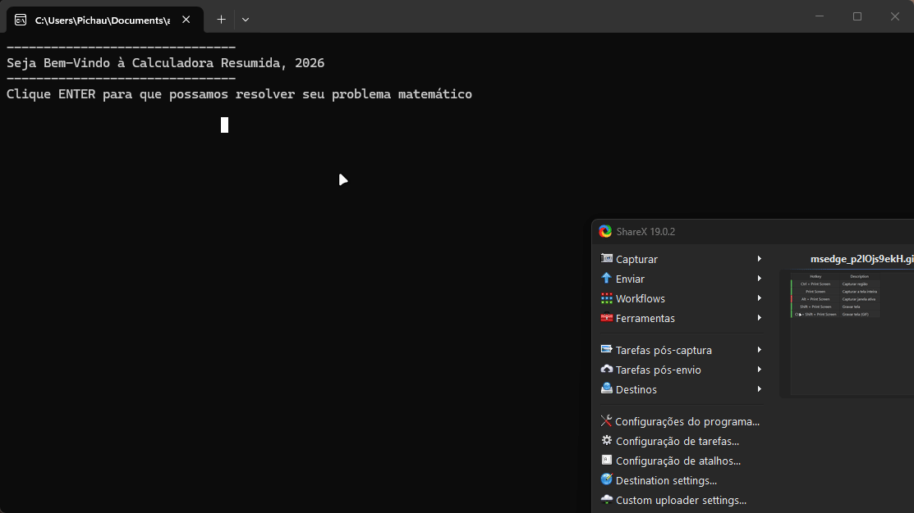

# Calculadora

## Introdução

Uma calculadora de console simples feita no curso **Full-Stack da Academia do Programador**.

## Funcionalidades

* **Operações básicas:** realiza somas, subtrações, multiplicações e divisões com facilidade.
* **Tratamento de divisão por zero:** a calculadora é capaz de validar erros de divisão por zero.
* **Tabuada:** a calculadora é capaz de gerar a tabuada de um número informado.
* **Histórico de operações:** a calculadora é capaz de armazenar um histórico das operações anteriores.

## Como utilizar o programa

1. Clone o repositório ou baixe o código comprimido em `.zip`.
2. Abra o terminal e navegue até a pasta raiz do projeto.
3. Utilize o comando abaixo para restaurar as dependências do projeto:

```
dotnet restore
```

4. Em seguida, compile e execute o projeto com o comando:

```
dotnet run --project Calculadora.ConsoleApp
```

## Requisitos

* .NET SDK 10.0